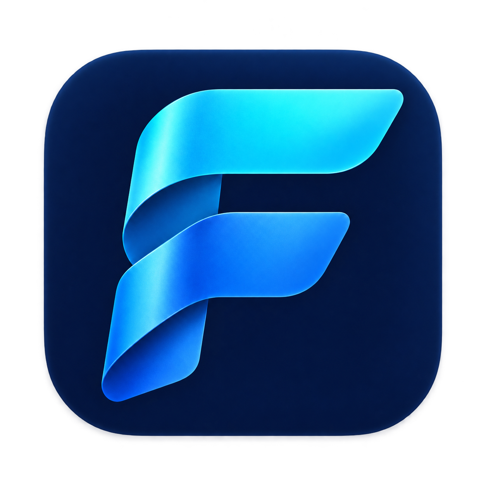
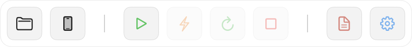
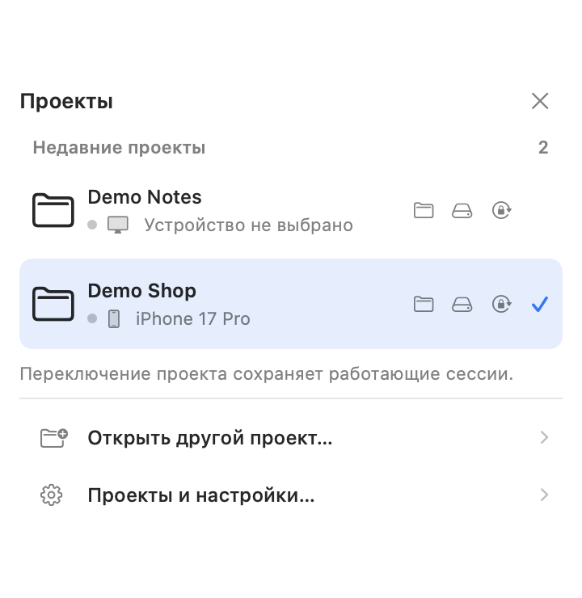
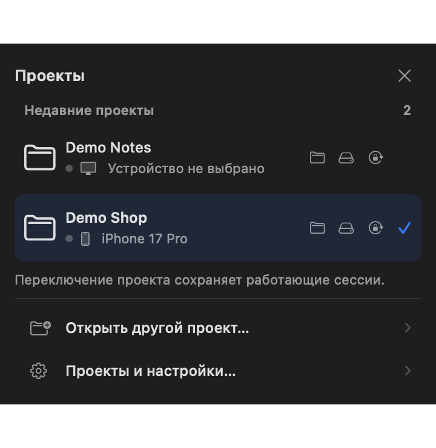
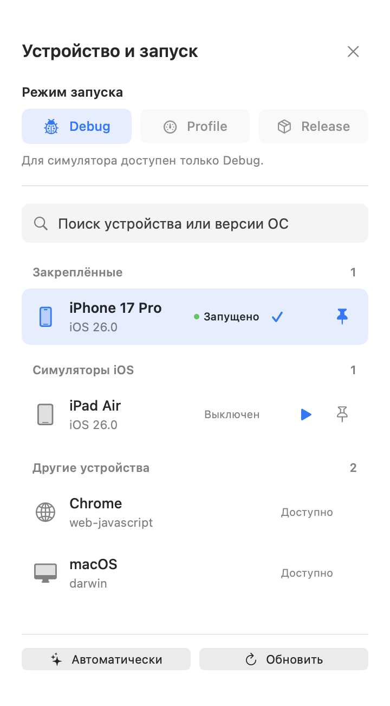
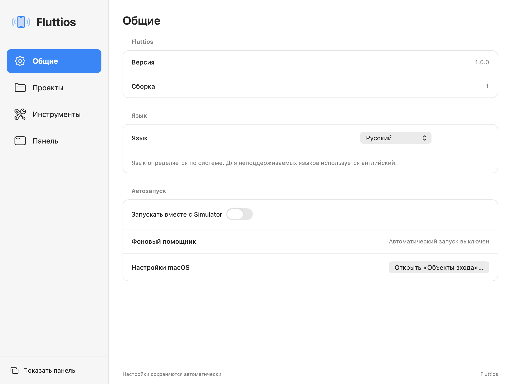
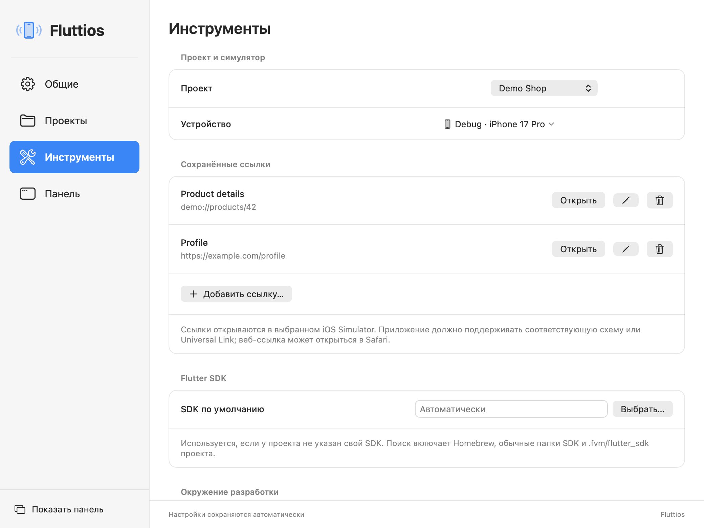

<div align="center">
  
  <h1>Fluttios</h1>
  <p><strong>Flutter controls. Right beside your simulator.</strong><br>Управляйте Flutter прямо рядом с симулятором.</p>
  <p>
    
    
    
    <a href="LICENSE"></a>
  </p>
  <p><a href="#русский">Русский</a> · <a href="README.en.md">English</a> · <a href="CHANGELOG.md">Changelog</a> · <a href="SECURITY.md">Security</a></p>
  
</div>

## Русский

**Fluttios — нативная утилита macOS для Flutter-разработки.** Компактная панель располагается рядом с Simulator / Device Hub или работает отдельно. Переключайте проекты, запускайте приложение и обновляйте Dart-код без постоянного перехода в Terminal или IDE. На каждый проект создаётся независимая сессия.

Версия **1.0.0**, сборка **1**. Исходный код распространяется по MIT. Готовую локальную сборку можно получить по инструкции ниже; наличие тега не означает наличие подписанного и нотарифицированного установщика.

## Как это выглядит

Снимки показывают настоящие SwiftUI-представления Fluttios с **вымышленными демонстрационными данными**. Пользовательские приложения, их экраны, реальные пути, логи, UDID и имена рабочих проектов не показаны. Это снимки интерфейса, а не подтверждение запуска изображённых проектов.

<table>
  <tr><th>Проекты · светлая тема</th><th>Проекты · тёмная тема</th></tr>
  <tr><td></td><td></td></tr>
  <tr><th>Устройство и режим запуска</th><th>Настройки и версия</th></tr>
  <tr><td></td><td></td></tr>
</table>

<details>
<summary>Сохранённые ссылки и инструменты</summary>



</details>

## Все функции

| Возможность | Что делает |
| :--- | :--- |
| **Run / Hot Reload / Hot Restart / Stop** | Запускает проект, обновляет Dart с сохранением состояния, перезапускает Dart со сбросом состояния, останавливает выбранную сессию. Reload и Restart доступны в Debug. |
| **Независимые сессии** | Переход A → B → A сохраняет процессы. Скрытие панели и закрытие настроек не останавливают проекты. Выход предлагает остановить все сессии или отменить выход. |
| **Сохранённые проекты** | Открытие папки с `pubspec.yaml`, переключение, поиск при списке более пяти проектов, исходная иконка iOS/macOS/Android/web с fallback на папку. Пути доступны в подсказках. |
| **Настройки проекта** | Устройство, режим и SDK сохраняются отдельно. Можно указать новое расположение, удалить запись или очистить список с подтверждением; папки и данные остаются на диске. Работающую сессию сначала нужно остановить. Символические ссылки не создают дубликатов. |
| **Устройства** | iOS Simulator через Xcode; физические iPhone/iPad, Android, macOS и браузеры — через Flutter. Поиск по имени/ОС, ручное обновление, статусы, закрепление симуляторов и запуск выключенного симулятора без Run проекта. Платформа должна поддерживаться самим проектом. |
| **Автоматический выбор** | Предпочитает запущенный доступный iOS Simulator, иначе запускает первый доступный. Android, desktop и браузер автоматически не выбираются. Недоступное сохранённое устройство требует нового выбора. |
| **Debug / Profile / Release** | Режим сохраняется на проект. На iOS Simulator доступен только Debug. Устройство и режим работающей сессии меняются после Stop; для обновления Profile/Release используйте Stop → Run. |
| **SDK и FVM** | SDK проекта имеет приоритет над общим. Автопоиск проверяет `.fvm/flutter_sdk`, стандартные установки и PATH. Проверка инструментов показывает ошибки Flutter/Xcode; полный Xcode обнаруживается даже при выбранных Command Line Tools без смены системного `xcode-select`. SDK не скачивается, CLI FVM не запускается. |
| **Этапы операций** | Проверка SDK, подготовка устройства, сборка, установка, запуск и команды сессии показываются индикатором и текстом. Flutter не сообщает общий процент сборки. |
| **Логи и ошибки** | Отдельная консоль проекта, выделение текста, копирование и очистка, до 2000 записей на сессию. Ошибки доступны из меню панели. Dart VM Service разделяет Dart-логи Debug-сессий симуляторов; остальные цели используют поток собственного Flutter-процесса. |
| **Память Dart** | В открытом меню проектов Debug-сессия iOS Simulator показывает используемую кучу основного Dart isolate, обновляемую примерно каждые три секунды. Это не полная RAM приложения; при отсутствии данных показывается режим. |
| **Сохранённые ссылки** | Добавление, редактирование, удаление и открытие deep links/HTTP/HTTPS в конкретном запущенном iOS Simulator. Список отдельный для каждого проекта. Приложение должно поддерживать ссылку; веб-ссылка может открыться в Safari. |
| **Папки и разрешения** | Кнопки в строке проекта открывают папку исходников и актуальный контейнер данных в Finder. Сброс разрешений относится только к выбранному установленному приложению в iOS Simulator и сохраняет файлы; сначала нужен Stop. |
| **Привязка панели** | Автоматическая или ручная привязка к окну Simulator / Device Hub, расположение сверху/снизу/слева/справа, адаптация к размеру окна и доступному месту монитора. Перетаскивание свободного участка двигает панель вместе с симулятором. |
| **Свободное положение** | Отдельная панель с сохранением координат. В привязанном режиме скрывается при уходе из симулятора, его скрытии, сворачивании или закрытии окна; возвращается при активации. Фокус в настройках временно скрывает панель. Иконка строки меню возвращает её. |
| **Компактный интерфейс** | Светлая/тёмная тема macOS, системные иконки, подсказки и accessibility labels. Горизонтальная панель следует ширине окна; на ширине менее 380 points Reload/Restart переходят в меню. Вертикальная панель сохраняет все четыре действия. |
| **Автозапуск** | Login item через SMAppService открывает Fluttios при запуске Simulator. Проекты запускаются только по Run. Опция отключается в настройках; macOS может потребовать подтверждение в «Объектах входа». |
| **Русский / English** | Автоматический выбор по языку системы и ручное переключение без перезапуска сессий. Для остальных системных языков используется английский. Внешний вывод Flutter/Xcode не переводится. |

## Первый запуск

1. Соберите Fluttios по инструкции ниже. Для постоянного использования перенесите `dist/Fluttios.app` в `/Applications` и запускайте эту копию.
2. Приложение живёт в строке меню. Нажмите его иконку → шестерёнка → «Настройки…» → «Проекты» → «Открыть проект…». Выберите папку Flutter-проекта с `pubspec.yaml`.
3. Выберите устройство и Debug. При необходимости укажите Flutter SDK в настройках проекта или общий SDK в «Инструментах» и выполните проверку инструментов.
4. Для привязки панели откройте «Панель» → «Разрешить доступ…» и разрешите **Fluttios** в Настройках системы → Конфиденциальность и безопасность → Универсальный доступ. Без этого разрешения Flutter работает со свободной панелью. Разрешение нужно основному приложению, а не помощнику.
5. Нажмите **Run**. Изменили Dart → **Reload**. Нужен сброс состояния → **Restart**. Изменили Swift/Objective-C, плагины или нативные настройки → **Stop**, затем **Run**.
6. При желании включите «Запускать вместе с Simulator» в «Общих». В этом же разделе отображаются версия **1.0.0** и номер сборки.

## Сборка из исходного кода

Нужны **macOS 14+**, полный **Xcode с macOS SDK**, **Swift 5.9+** и Python 3 для проверки версии. Flutter SDK и iOS runtime нужны для запуска Flutter-проектов, но не для сборки утилиты. Физические iOS-устройства требуют доверия к Mac, режима разработчика и подписи Flutter-проекта в Xcode; Fluttios её не меняет.

```bash
git clone git@github.com:Shishani58/Fluttios.git
cd Fluttios
./scripts/build-app.sh
open dist/Fluttios.app
```

По умолчанию скрипт собирает универсальный Release **arm64 + x86_64**, вкладывает помощник и проверяет подписи. `CONFIGURATION=debug` выбирает Debug, `ARCHITECTURES=arm64` — одну архитектуру, `APP_OUTPUT` — другой путь. Также можно открыть `Fluttios.xcodeproj`, выбрать схему **Fluttios** и собрать в Xcode.

Для локального использования применяется ad-hoc подпись или сертификат предыдущей сборки. `SIGNING_IDENTITY` явно задаёт сертификат. При смене ad-hoc подписи macOS может потерять разрешение Accessibility — используйте один сертификат для стабильной локальной установки.

<details>
<summary>Подписанная сборка для распространения</summary>

Нужны сертификат **Developer ID Application** с приватным ключом в Keychain и профиль `notarytool`, заранее сохранённый в Keychain. Имена ниже — примеры, ключи не добавляются в репозиторий.

```bash
DISTRIBUTION=1 \
SIGNING_IDENTITY="Developer ID Application: Your Name (TEAMID)" \
NOTARY_PROFILE="fluttios-notary" \
./scripts/build-app.sh
```

Этот режим включает Hardened Runtime, secure timestamp, notarization, stapling и проверку Gatekeeper, после успеха создаёт `.app` и ZIP в `dist`. Ошибка не заменяет предыдущую сборку. Обычная сборка не отправляется Apple. Для этого релиза нотарифицированный установщик не публикуется.

</details>

## Проверки

Результаты релиза: [docs/release-checks.md](docs/release-checks.md).

```bash
./scripts/check-version.sh
xcrun swift test --build-system native
./scripts/verify-panel-presentation.sh
```

Если выбраны Command Line Tools, задайте `DEVELOPER_DIR` пути к полному Xcode. На новых Swift параметр `--build-system native` может выдать предупреждение deprecation.

Реальная интеграционная проверка выполняется отдельно: `./scripts/create-probes.sh`, затем запустите два iOS Simulator и выполните `FLUTTIOS_INTEGRATION=1 xcrun swift test --build-system native --filter IntegrationTests`. Она создаёт два изолированных проекта в `.build/integration` и останавливает только собственные сессии. Пользовательские проекты и симуляторы не удаляются. Логи остаются локально.

## Ограничения и данные

- Стандартный запуск использует `lib/main.dart`, схему Runner и конфигурацию режима. Выбор flavor, схемы, entrypoint и произвольных аргументов не представлен в интерфейсе.
- Автопривязка и инструменты ссылок/данных/разрешений работают только с iOS Simulator. При одинаковых именах устройств или неоднозначном заголовке нужна ручная привязка; потеря окна не останавливает Flutter.
- Подключение к внешним Flutter-процессам и восстановление сессий после выхода/перезагрузки не поддерживаются.
- Утилита не sandboxed. Для быстрых уведомлений окон используются недокументированные SkyLight/Accessibility symbols с fallback на публичные AX API. Проверка fallback: `FLUTTIOS_DISABLE_PRIVATE_WINDOW_API=1 dist/Fluttios.app/Contents/MacOS/Fluttios`. Распространение предназначено вне Mac App Store.
- Пути проектов, устройства и ссылки хранятся локально в `~/Library/Application Support/Fluttios/projects.json`; настройки — в UserDefaults. Логи могут содержать данные запускаемого приложения. Подробнее: [SECURITY.md](SECURITY.md).

## Устройство проекта и версии

`FluttiosCore` — проекты, SDK/Xcode, устройства, Flutter machine protocol, сессии и Dart VM Service. `Fluttios` — SwiftUI/AppKit, панель и Accessibility. `FluttiosHelper` — событийный login item. `Tests` — core-тесты и проверки поведения NSPanel.

Версии следуют **SemVer**: MAJOR — несовместимые изменения, MINOR — новые совместимые функции, PATCH — исправления. При релизе обновляются `VERSION`, версии app/helper в `Resources/*Info.plist`, fallback в настройках, badge и [CHANGELOG.md](CHANGELOG.md); номер сборки повышается. `check-version.sh` проверяет совпадение перед сборкой. Релиз отмечается Git-тегом `vX.Y.Z`.

[MIT](LICENSE) · [English documentation](README.en.md) · [История изменений](CHANGELOG.md)
